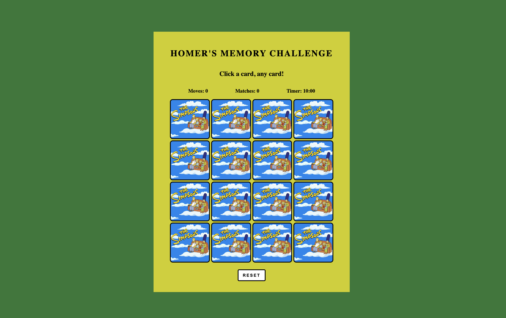

# 
**Homer's Memory Challenge!**

Enjoy a Simpsons themed memory matching card game! In this game, you must pick two cards to see if they are a match. If they are not a match, you can keep trying. If you do get a match, the cards matched will stay flipped for you. Keep track of every card clicked by looking at the Move counter. You can also know your score by looking at the Matches counter for every match that is made. However, watch out! You will only have three minutes per game or it is game over... D'oh! But don't worry! There is a reset button to try again. Once all of the cards are matched with its corresponding pair, the timer will stop and you have won the game! Good luck and have fun with Homer's Memory Challenge!

# [Play Homer's Memory Challenge here!](https://mmcg-br.netlify.app/) 🍩

## [Planning Materials](https://docs.google.com/document/d/119J0NP4qZ_RGF30xsDbitaX8LVAcPrxDHGMycA0jUIQ/edit?usp=sharing) 💭
## Technologies used 💻
        

## [Credits](https://docs.google.com/document/d/1DInBiYHscKJ5IsrXjgRYUO5xqDJmOcW718aeQhDqxVE/edit?usp=sharing) 👏

    

## Ice Box 🧊

- [x] Font Design
- [ ] Highlight Cards flipped
- [x] Card Animations
- [x] Timer
- [x] Sound
- [x] Confetti
- [x] Audio Button
- [ ] Difficulty Modes
- [ ] Different Themes for each difficulty; e.g. Universal Studios Park themes
- [ ] Change Confetti to Themed emotes
- [ ] Navigation Bar
- [ ] Dark Mode
- [ ] Mobile Responsive
